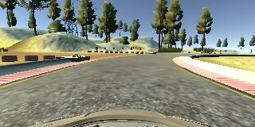

# **Behavioral Cloning** 

The goals / steps of this project are the following:
* Use the simulator to collect data of good driving behavior
* Build, a convolution neural network in Keras that predicts steering angles from images
* Train and validate the model with a training and validation set
* Test that the model successfully drives around track one without leaving the road
* Summarize the results with a written report


## Rubric Points
### Here I will consider the [rubric points](https://review.udacity.com/#!/rubrics/432/view) individually and describe how I addressed each point in my implementation.  

---
### Files Submitted & Code Quality

#### 1. Submission includes all required files and can be used to run the simulator in autonomous mode

My project includes the following files:
* model.py containing the script to create and train the model
* drive.py for driving the car in autonomous mode
* model.h5 containing a trained convolution neural network 
* writeup_report.md summarizing the results

#### 2. Submission includes functional code
Using the Udacity provided simulator and my drive.py file, the car can be driven autonomously around the track by executing 
```sh
python drive.py model.h5
```

#### 3. Submission code is usable and readable

The `model.py` file contains the code for training and saving the convolution neural network. The file shows the pipeline I used for training and validating the model, and it contains comments to explain how the code works. No generators were needed on the combination of the AWS instance used to train and the size of the data set.

### Model Architecture and Training Strategy

#### 1. An appropriate model architecture has been employed

The model I used is adapted from NVidia's 'End to End Learning for Self-Driving Cars'. See more on their [blog post](https://devblogs.nvidia.com/parallelforall/deep-learning-self-driving-cars/). The only difference is the input shape reflects the data we get from the simulator i.e (3,160,320).

The model has 5 convolutional layers all with relu activations and 3 fully connected layers before the final output.

Normalisation and pre processing are done within the model. The section below details each layer.


#### 2. Attempts to reduce overfitting in the model

The number of epochs were lowered so the validation loss was monotonically decreasing.

The model was trained and validated on different data sets to ensure that the model was not overfitting (see train/test split) . The model was tested by running it through the simulator and ensuring that the vehicle could stay on the track.

Since the car seemed to be able to navigate the track with the current model, no further work was done to prevent overfitting.

#### 3. Model parameter tuning

The model used an adam optimizer, so the learning rate was not tuned manually. The epochs were adjusted as mentioned above. Mean Squared Error was used as the loss function which is well suited for regression models.

#### 4. Appropriate training data

Training data was chosen to keep the vehicle driving on the road. I used a combination of center lane driving, recovering from the left and right sides of the road, driving the track in the opposite direction and multiple times over some of the trickier turns.

For details about how I created the training data, see the next section. 

### Architecture and Training Documentation

#### 1. Solution Design Approach

The overall strategy for deriving a model architecture was to begin with a known model (LeNet) to get to some kind of baseline, then depending on the outcome either tweak the LeNet model or try successively more powerful models, such as some of the more recent ImageNet winners or others (One of NVidia's) cited in the course material.

The mean squared error was getting quite low with LeNet but I decided to go on to a new model (see previous section for details)

While I was training and modifying the model I was periodically testing the model driving the track. Feedback (i.e quality of the simulated driving) from this led me to think that some scenarios may be underrepresented in the data set. So a combination of updating the model and data augmentation was used.

At the end of the process, the vehicle is able to drive autonomously around the track without leaving the road.

#### 2. Final Model Architecture

The final model architecture consisted of a convolution neural network with the following layers and layer sizes.

Layer Type | Options 
--- | ---
Lambda | normalise pixel values between -0.5,0.5
Lambda | crop top 70 pixels and bottom 25 pixels
Convolution | 24 features, 5,5 kernel, 2,2 stride, relu activation
Convolution | 36 features, 5,5 kernel, 2,2 stride, relu activation
Convolution | 48 features, 5,5 kernel, 2,2 stride, relu activation
Convolution | 64 features, 3,3 kernel, relu activation
Convolution | 64 features, 3,3 kernel, relu activation
Flatten | 
Dense | 100 neurons
Dense | 50 neurons
Dense | 10 neurons
Dense | 1 neuron (steering angle)


#### 3. Creation of the Training Set & Training Process

To capture good driving behavior, I first recorded two laps on track one using center lane driving. Here is an example image of center lane driving:


I then recorded two laps in the opposite direction.



After seeing the model had a particularly difficult time on some turns I focussed on gathering just turning data.


To augment the data set, I also used the left and right camera images, altering the driving angle by ±0.2

Center


Left


Right


After the collection process, I had 25620 data points.

I finally randomly shuffled the data set and put 20% of the data into a validation set. 

I used this training data for training the model. The validation set helped determine if the model was over or under fitting. The ideal number of epochs was 3 as evidenced by the model no longer monotonically decreasing it's validation error. I used an adam optimizer so that manually training the learning rate wasn't necessary.

### Simulation

#### 1. Is the car able to navigate correctly on test data?

A full lap of track 1 can be seen in `video.py` and van be verified on the simulator:

A single modification (to the driving speed) has been added to `drive.py` simply so the car can complete the track in less time.

```sh
python drive.py model.h5
```